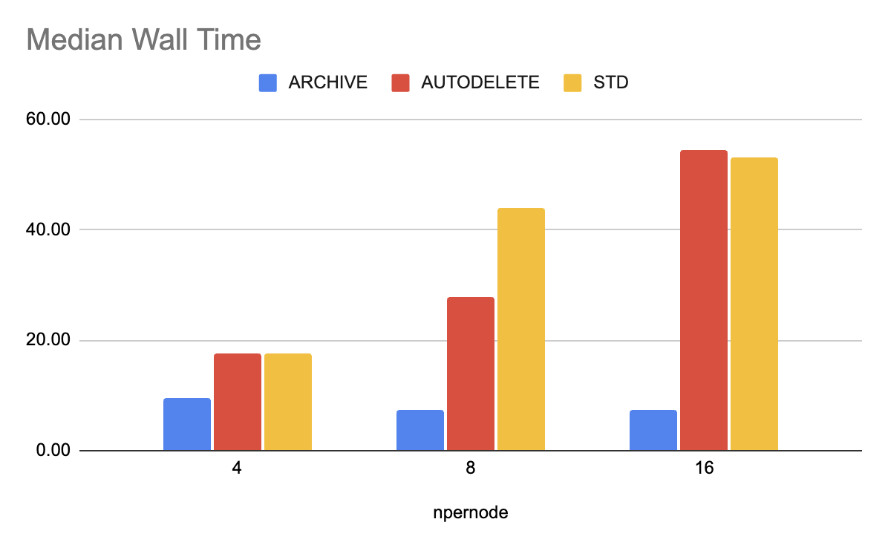
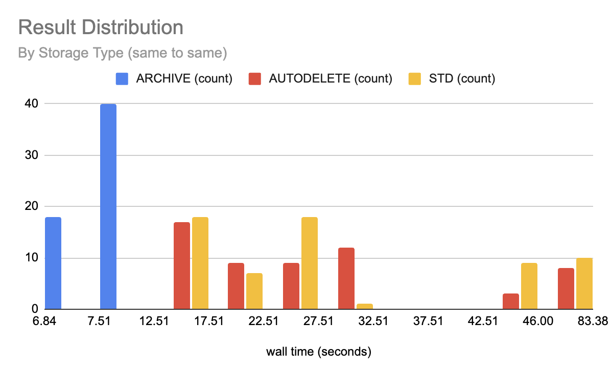
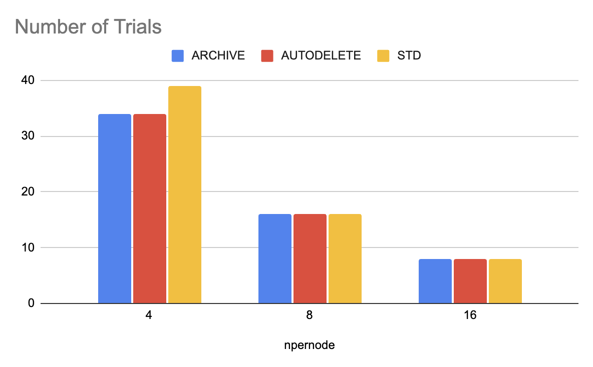

# Phase 7 Performance Testing

An exploration of the runtime performance of the [WaveSolveMPI (phase 7)](https://byuhpc.github.io/sci-comp-course/project/phase7.html) code on different storage mediums available on the BYU  SuperComputer.

We researched the following performance on the following storage locations:

* SHM (`/dev/shm`)
* TMP (`/tmp`)
* ARCHIVE (`/nobackup/archive`)
* AUTODELETE (`/nobackup/autodelete`)

After analyzing all the data, **ARCHIVE** is clearly the most performant storage system to use for this MPI task.

## Results

No trial of SHM or TMP ever completed successfully. Intuitively, both of these storage locations are node-local, which means they cannot be used to share information between different nodes.

The runtime for rach trial is reported in seconds.

### Median Wall Time

The median time required to run a single trial for each storage medium and node count in seconds.

Notably, on the ARCHIVE system, total performance improved (wall time decreased) as the number of processes increased. However, on both the AUTODELETE and STD systems, total performance significantly decreased due to I/O bottlenecking.



| npernode | ARCHIVE | AUTODELETE | STD |
| --- | --- | --- | --- |
| 4 | 9.66 | 17.54 | 17.66 |
| 8 | 7.41 | 27.70 | 43.83 |
| 16 | 7.46 | 54.54 | 53.21 |
| Grand Total | 9.35 | 25.44 | 25.33 |

### Result Distribution

This chart visualizes the run times on a common statistical distribution.

It shows that all the ARCHIVE trials are significantly faster than all of the AUTODELETE and STD trials.



### Count of Trials

A total of **179 successful trials** were completed, with a total combined wall time of **66.9 minutes**.

An even number of trials were performed for each storage medium.



| npernode | ARCHIVE | AUTODELETE | STD | Grand Total |
| --- | --- | --- | --- | --- |
| 4 | 34 | 34 | 39 | 107 |
| 8 | 16 | 16 | 16 | 48 |
| 16 | 8 | 8 | 8 | 24 |
| Grand Total | 58 | 58 | 63 | 179 |

### Raw Results

The following files contain the research results. CSV files are delimited with a space character.

| File | Description |
| ---- | :---------- |
| [`results.log`](./results.log) | Raw evaluation output from processes |
| [`data.csv`](./data.csv) | Extracted run times from `results.log` |
| [`results_cleaned.log`](./results_cleaned.log) | Raw evaluation output, manually cleaned to error times |
| [`data_cleaned.csv`](./data_cleaned.csv) | Extracted run times from `results_cleaned.log` |

These charts and data were analyzed with [this Google Sheet](https://docs.google.com/spreadsheets/d/1woxD0QlrEMhaNHeGzPmCn2BFTa4VjtQ_CSDahKwh5DI/edit?usp=sharing).

## Process

### Setup

```shell
## Context
pwd
# /home/finljam/student-repos/Despain-fall-2024/build
git show
# commit 5b4a8e3992994ca6e98402333fbccdce0fffe493 (HEAD -> updated-phase7)
# Author: James Finlinson <finljam@byu.edu>
# Date:   Wed Feb 19 12:19:19 2025 -0700
#
#     Exclude build directors from git going forward

# commit 9ce2d35bd293d74a89ac747c0572f71ae86d5524 (tag: phase7, origin/updated-phase7)
# Author: Paige Despain <paigeid@byu.edu>
# Date:   Wed Dec 4 12:58:55 2024 -0700
#
#     should work
```

```shell
## Prepare environment
salloc -p m9 -t 60 --mem 70G -N 2 --ntasks-per-node 28
# module load cmake gcc/14.1 openmpi/5.0
module load cmake gcc/14.1 openmpi/5.0 mpl grade-scicomp
```

```shell
## Prepare files
echo $MEDIUM_IN
# /grphome/fslg_course/grading/wavefiles/2D/2d-medium-in.wo

SHM_BASE="/dev/shm"
TMP_BASE="/tmp"
AUTODELETE_BASE="/nobackup/autodelete/usr/$USER"
ARCHIVE_BASE="/nobackup/archive/usr/$USER"

medium_in_file_name=`basename $MEDIUM_IN`
export MEDIUM_STD_IN="$MEDIUM_IN"
export MEDIUM_SHM_IN="$SHM_BASE/$medium_in_file_name"
export MEDIUM_TMP_IN="$TMP_BASE/$medium_in_file_name"
export MEDIUM_AUTODELETE_IN="$AUTODELETE_BASE/$medium_in_file_name"
export MEDIUM_ARCHIVE_IN="$ARCHIVE_BASE/$medium_in_file_name"

cp $MEDIUM_IN $MEDIUM_SHM_IN
cp $MEDIUM_IN $MEDIUM_TMP_IN
cp $MEDIUM_IN $MEDIUM_AUTODELETE_IN
cp $MEDIUM_IN $MEDIUM_ARCHIVE_IN

medium_out_file_name="medium.out"
export MEDIUM_STD_OUT="$medium_out_file_name"
export MEDIUM_SHM_OUT="$SHM_BASE/$medium_out_file_name"
export MEDIUM_TMP_OUT="$TMP_BASE/$medium_out_file_name"
export MEDIUM_AUTODELETE_OUT="$AUTODELETE_BASE/$medium_out_file_name"
export MEDIUM_ARCHIVE_OUT="$ARCHIVE_BASE/$medium_out_file_name"
```

```shell
## Compile source
mkdir build && cd build
cmake ..
make -j
```

### Evaluation

```shell
## Solve waves
N_PER_NODE=4
# /bin/time -f "%e %S %U" mpirun --npernode $N_PER_NODE ./wavesolve_mpi $MEDIUM_STD_IN $MEDIUM_STD_OUT

# Evaluates the project using a known storage code
# Storage codes: STD SHM, TMP, AUTODELETE, ARCHIVE
# Usage: evaluate STD
evaluate() {
  local npernode=${N_PER_NODE:-4}

  local storage_code=$1
  if [ -z "$storage_code" ]; then
    echo "Error: No storage specified. Usage: evaluate <STORAGE_CODE>" >&2
    return 1
  fi

  local in_var="MEDIUM_${storage_code}_IN"
  local out_var="MEDIUM_${storage_code}_OUT"

  echo /bin/time -f "$storage_code ($npernode) %e %S %U" mpirun --npernode "$npernode" ./wavesolve_mpi "${!in_var}" "${!out_var}"
  /bin/time -f "RES: $storage_code ($npernode) %e %S %U" mpirun --npernode "$npernode" ./wavesolve_mpi "${!in_var}" "${!out_var}"
}
```

```shell
## Repeatedly evaluate tests
N_PER_NODE=4
N_PER_NODE=8
N_PER_NODE=16

# Include process output
for i in {1..8}; do
  echo "Starting iteration $i" `date`;
  evaluate STD >> results.log 2>&1;
  evaluate AUTODELETE >> results.log 2>&1;
  evaluate ARCHIVE >> results.log 2>&1;
done;

# Silence process output
for i in {1..8}; do
  echo "Starting iteration $i" `date`;
  evaluate STD 2>> results.log > /dev/null
  evaluate AUTODELETE 2>> results.log > /dev/null
  evaluate ARCHIVE 2>> results.log > /dev/null
done;
```

### Data Extraction

```shell
## Extract results
mv results.log ..
cd ..

awk 'BEGIN {print "storage npernode wall_secs sys_secs usr_secs"} /^RES: / {sub(/^RES: /, ""); print}' results.log > data.csv
```

```shell
## Manually clean results
cp results.log results_cleaned.log
echo "TODO: Manually remove early termination results, etc..."
awk 'BEGIN {print "storage npernode wall_secs sys_secs usr_secs"} /^RES: / {sub(/^RES: /, ""); print}' results_cleaned.log > data_cleaned.csv
```
