# Architecture Diagram

This [Architecture Diagram](https://mermaid.js.org/syntax/architecture.html) visualizes the relationships between entities and services involved in this project.
It also describes and justifies each of the particular architecture choices in the context of the broader application.

## Diagram

```mermaid
architecture-beta

%% --- ENTITIES ---

group   firebase(cloud)[Google Firebase]
%% TODO: Use logos:firebase
service database(database)[Firestore Database] in firebase
service hosting(cloud)[Firebase Hosting] in firebase
service syncApi(server)[Cloud Functions] in firebase
service auth(server)[Firebase Auth] in firebase

group   rpAPI(internet)[Resource Planning API]
service rpAuth(cloud)[OAuth API] in rpAPI
service rpProjects(cloud)[Projects API] in rpAPI
service rpJobTitles(cloud)[Job Titles API] in rpAPI
service rpRequests(cloud)[Requests API] in rpAPI
junction rpJunc1 in rpAPI
junction rpJunc2 in rpAPI


group   frontend(server)[Web App]
service ui(server)[User Interface] in frontend
service ganttChart(ic:baseline-waterfall-chart)[Gantt Chart] in frontend
service webAwesome(ic:baseline-smart-button)[Web Awesome] in frontend
service firebaseUI(user)[FirebaseUI Auth] in frontend
junction frontendJunc in frontend
junction frontBottomRight in frontend
junction frontBottomLeft in frontend

%% --- RELATIONSHIPS ---

%% Web App Relationships
frontendJunc:B --  T:ui
frontendJunc:L --> R:ganttChart
frontendJunc:R --> L:webAwesome
ui:R <-- L:frontBottomRight
ui:L <-- R:frontBottomLeft
firebaseUI:B <--> T:auth
frontBottomLeft:L -- R:firebaseUI

%% Firebase relationships
ui:B <-- T:database
database:R <-- L:syncApi
frontBottomRight:B --> T:syncApi
hosting:T -- B:frontBottomLeft

%% Resource Planning API Relationships
syncApi:R <-- L:rpJunc1
rpJunc1:R -- L:rpJunc2
rpAuth:B -- T:rpJunc1
rpProjects:T -- B:rpJunc1
rpJobTitles:T -- B:rpJunc2
rpRequests:B <-- T:rpJunc2
```

## Description

The front end uses external packages to offload as much of the technical energy as possible.
[Select Gantt Component](https://github.com/nicolson-construction/procore-pco/issues/1) contains the discussion about which package to use.
We leverage WebAwesome for our component system: buttons, modals, inputs, panels, etc...

The app is supported by Google Cloud backend. The [Firebase family](https://firebase.google.com/docs/build) of products are highly integrated and meet all our needs.
The Firestore Database is necessary to persistently store our task data, and it also caches the data received from the Resource Planning API.
Additionally, the Firestore Database will notify the webapp of any changes enabling a real-time, collaborative experience.
The Firebase Cloud Functions interact directly with the Resource Planning (RP) APIs in order to update data directly in the Firestore Database and submit API changes to RP.
It would have been easier to perform these operations directly from the web client; however, CORS errors prevented us from embarking on this easy route.
In the end, relying on Cloud Functions will afford us more security and consistency if/when multiple version pervade the deployment.

The [Resource Planning API](https://wfp-quickconnect.readme.io/docs/getting-started) exposes endpoints for each of its entities.
Currently, we read only from most of the endpoints since we don't need to duplicate the kinds of changes already available in RP.
However, we do write to the Requests API. In the future, we may write to the Projects API in order to edit some details.
Though it would be more complicated, we may consider the active assignments on each project since it could allow us to visualize current data.

## Resources

Lists of documentation for each of the key entities in the project. This list is grouped to mirror the diagram above.

* Frontend Packages
    * [Web Awesome](https://backers.webawesome.com/)
    * [High Charts Gantt](https://www.highcharts.com/products/gantt/)
    * [Google Charts Gantt](https://developers.google.com/chart/interactive/docs/gallery/ganttchart)
    * [React Google Charts](https://www.npmjs.com/package/react-google-charts)
* Google Cloud Resources
    * [Cloud Firestore _Database_](https://firebase.google.com/docs/firestore)
    * [Firebase Authentication](https://firebase.google.com/docs/auth)
    * [Firebase Cloud Functions](https://firebase.google.com/docs/functions)
    * [Firebase Hosting](https://firebase.google.com/docs/hosting) _(Not App Hosting)_
* Resource Planning API
    * [Auth API](https://wfp-quickconnect.readme.io/docs/auth)
    * [Projects API](https://wfp-quickconnect.readme.io/docs/read-2)
    * [Job Titles API](https://wfp-quickconnect.readme.io/docs/positions)
    * [Requests API](https://wfp-quickconnect.readme.io/docs/create-6)
