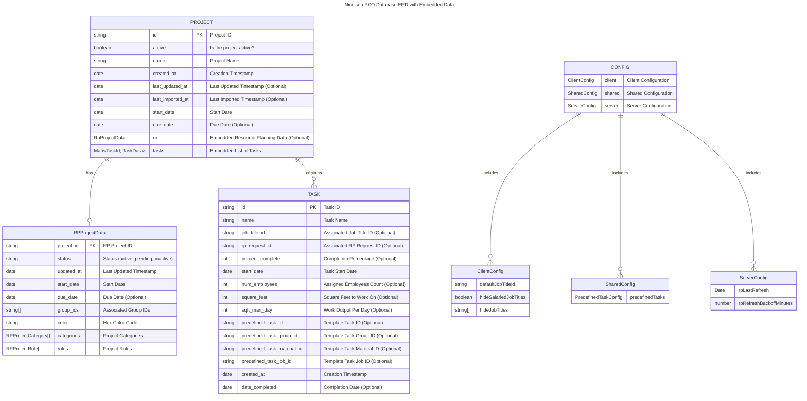

# Database Design Diagram

This diagram illustrates the structure of our Firestore database, modeling the relationships between `Project`, `Task`, and `Config` entities. Unlike traditional relational databases, Firestore leverages embedded documents for optimized read performance.

- **Projects** serve as the primary entities, containing an embedded list of **Tasks** instead of using a separate collection.
- **RpProjectData** is embedded within each **Project**, capturing additional metadata from external systems.
- **Tasks** store key details such as job assignments, completion status, and predefined template references.
- **Config** holds structured configuration settings for the system, including `ClientConfig`, `SharedConfig`, and `ServerConfig`.

See the [sample database data](./entity-design-sample-data.json) to see how this data lives in the database.

## Diagram

The diagram below visually represents these relationships and data structures:

