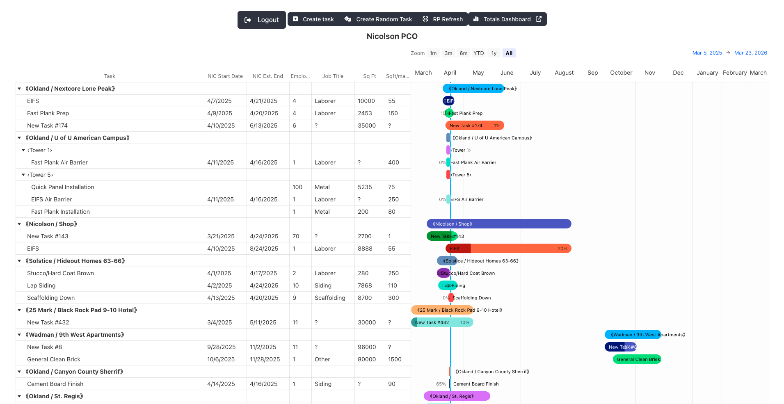
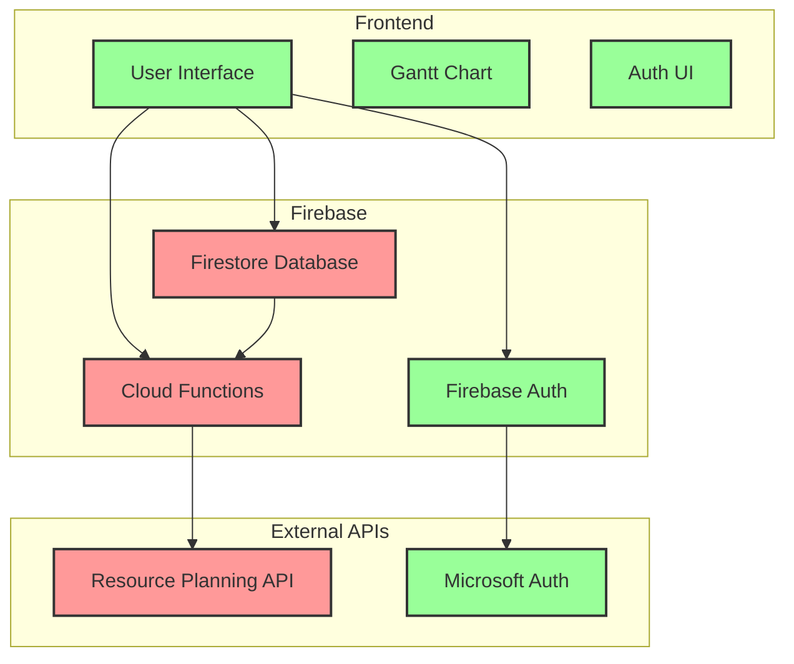

# Nicolson PCO - Database Design Presentation

## Project Summary
Nicolson PCO is a web-based project management tool that extends Procore's Resource Management capabilities, focusing on task tracking and workforce planning. The system uses Firebase Firestore as its primary database, with a React-based frontend that visualizes project timelines using Highcharts Gantt charts. The application integrates with Microsoft authentication and a Resource Planning API to manage project data and user access.

## System Architecture and Scaling Considerations

See more detailed resources:
- [Architecture Diagram](./architecture-diagram.md)
- [Entity Design Diagrams](./entity-design-diagram.md)

### Scaling Bottlenecks and Limits

1. **Firestore Database**
   - **Bottleneck**: Document write operations and hotspotting
   - **Why**: While Firestore no longer has hard caps on database size, performance considerations still apply:
     - High write rates to a single document can cause contention and increased latency
     - The system must synchronously apply writes across a quorum of replicas
     - Our embedded document structure (tasks within projects) means each project update requires a full document write
     - We must carefully manage write patterns to avoid hotspotting, especially with our task update patterns
     - Since we use the ResourcePlanning IDs for our project entities, Hotspotting could be an issue if ResourcePlanning uses monotonically increasing identifiers. This risk is mitigated by the relatively stable number of projects (projects are only created occasionally.)
   - This means that concurrently editing different tasks on the same project may lead to performance issues, but if many users are individually editing tasks from different projects, there is no concern.

2. **Cloud Functions**
   - **Limit**: 1,000 concurrent function executions per project
   - **Bottleneck**: API synchronization and data processing
   - **Why**: Our Cloud Functions handle all external API interactions and data synchronization. Each user action that requires RP API updates must go through these functions.

3. **Resource Planning API**
   - **Limit**: Rate limits not publicly documented
   - **Bottleneck**: External API calls and data synchronization
   - **Why**: All project data originates from this API, and our system must maintain synchronization with it.

4. **Firestore Free Tier Considerations**
   - **Daily Limits**:
     - 50,000 document reads
     - 20,000 document writes
     - 20,000 document deletes
     - 1 GiB stored data
     - 10 GiB outbound data transfer
   - **Why**: While these limits are generous for development and small-scale use, they need to be monitored as the application scales. We expect to stay well within these limits for our primary usage.

## Key Learnings

1. **Embedded Documents vs. Collections**
   - We chose to embed tasks within project documents rather than using separate collections
   - This decision improved read performance and leverages precise updates to specific fields to minimize data contention.
   - Lesson: Consider both read and write patterns when choosing between embedded documents and collections

2. **Authentication and Authorization Complexity**
   - Implementing a multi-level access system (Admin, Manager, Standard, Guest) required careful consideration of security rules
   - The guest access system with invite keys added significant complexity to the data model
   - Managing user access via fields on documents incurs additional `read` operations which are billed for every DB query. Auth Custom Claims are an alternative approach that avoid this behavior.
   - Lesson: Security requirements can significantly impact database design decisions

3. **Real-time Updates and Caching**
   - Firestore's real-time capabilities were crucial for collaborative features
   - We implemented a caching layer to reduce API calls to the Resource Planning system
   - Lesson: Balancing real-time updates with external API integration requires careful consideration of data freshness requirements

4. **React Change Management**
   - React as a framework is a new paradigm to me as a developer. The tools and techniques I have used before for responding to changes were not options, several
   - Lesson: Study up on the particular of a new framework, or stick with well-understood frameworks where you are comfortable with the nuances

## Failover Strategy

Firebase Firestore handles failover automatically as part of its managed service. The system:
- Option to replicate data across multiple regions
- Provides automatic failover in case of regional outages
- Maintains data consistency through its distributed architecture

## Questions and Feedback

We welcome your questions and feedback about:
- Our choice of embedded documents vs. collections
- The authentication and authorization system design
- Our approach to real-time updates and caching
- Any other aspects of the database design

I am especially looking for support/expertise dealing with React change management.

Please feel free to reach out with your thoughts!
