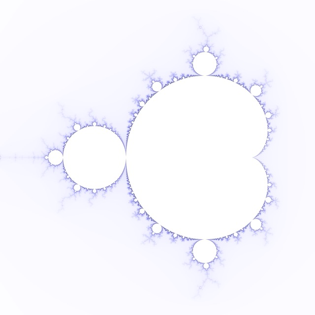
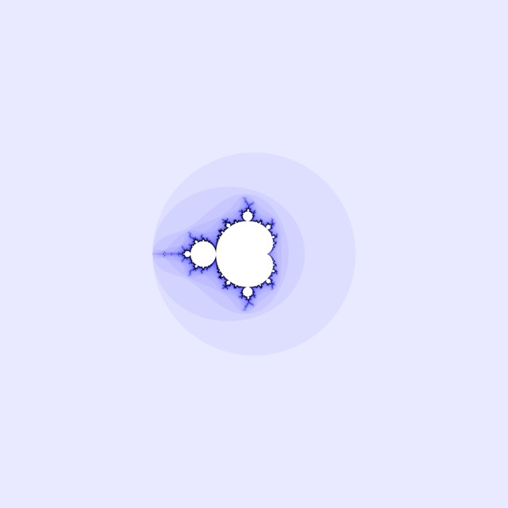
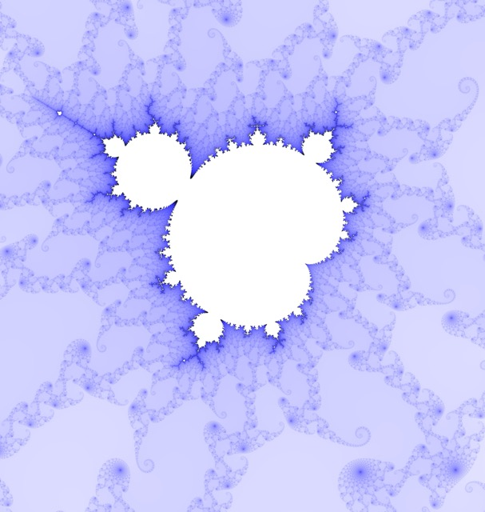
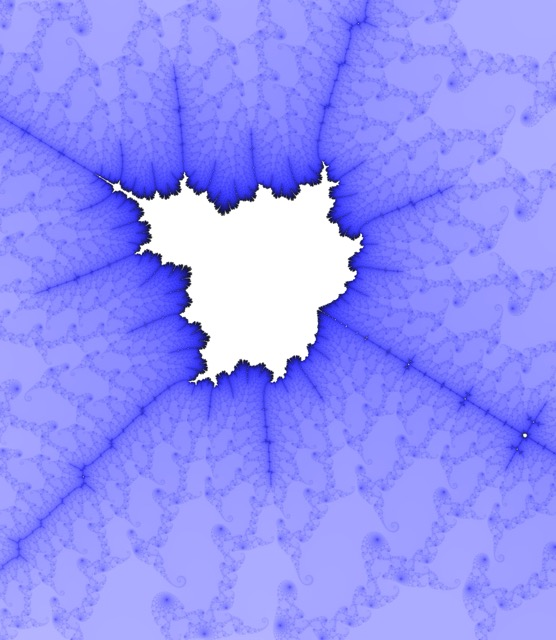
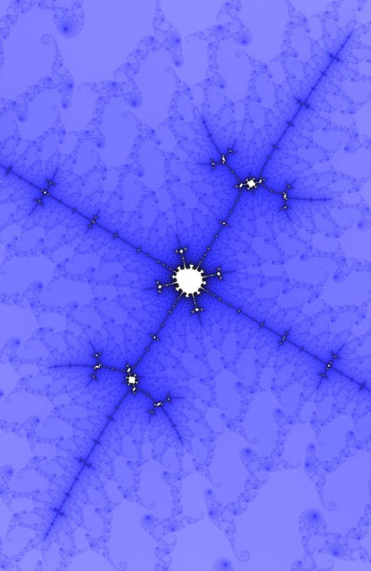
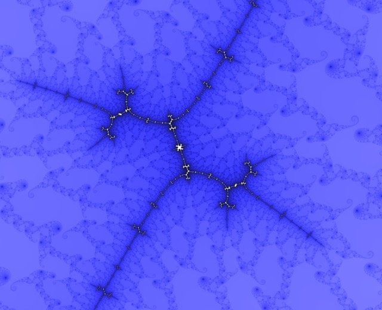
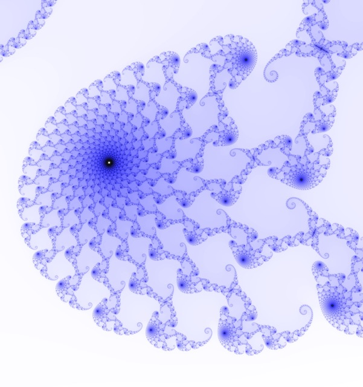
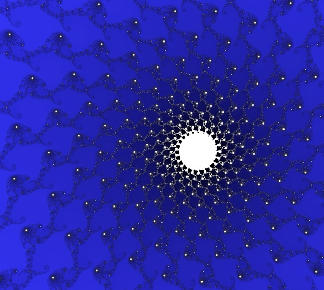

# Mandelbrot Image Exploration

Each of the following represents a chain of zooming in on features of choice on the mandelbrot set.

After generating each of the following images, they were copied to a local machine for zooming in and downsizing.

[This Desmos calculator](https://www.desmos.com/calculator/v2rmdgh1eh) was used to calculate the coordinates of particular regions of interest.

Each of the images was generated using `THREADS=32` and `SIZE="1000 8192"`. Each is shown here with medium compression.

## Mandelbrot Root

A sample of the root Mandelbrot set.

### Root



```shell
make draw COORDS="-1.75 0.75 -1.25 1.25"
```

### Perspective



```shell
make draw COORDS="-5 5 -5 5"
```

## Class Base

A journey beginning at the given class starter range.

### Zoomed In



```shell
make draw COORDS="0.270919281635 0.270925548542 0.00474482742471 0.00475143706702"
```

### Spear



```shell
make draw COORDS="0.270919979285 0.270920134963 0.00474987357177 0.00475005269128"
```

### T-Bone



```shell
make draw COORDS="0.270920119037 0.270920133353 0.00474991960556 0.00474994163725"
```

### French Dog



```shell
make draw COORDS="0.270920120883 0.270920121755 0.0047499215204 0.00474992222911"
```

### Ghost



```shell
make draw COORDS="0.270920121622 0.270920121676 0.00474992204362 0.0047499221011"
```

### Black Hole



```shell
make draw COORDS="0.270920121637 0.270920121639 0.00474992207611 0.0047499220779"
```

### Screensaver


```shell
make draw COORDS="0.270920121638 0.270920121639 0.00474992207677 0.00474992207714"
```
